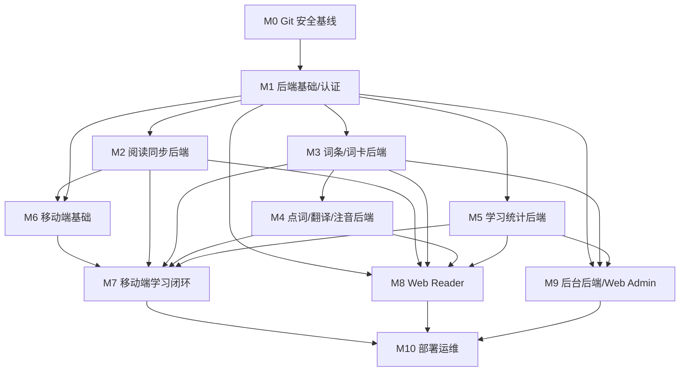

# Master Implementation Roadmap

本文件是 Study For Read Phone 的总实施索引。任何 AI 或开发者进入编码前，先从这里确认当前阶段、前置条件、入口任务卡和停止条件。

## 0. 总规则

- 唯一工作区：`D:\Codex\Study For Read Phone`
- 旧项目只读参考：`D:\Codex\Study for Read`
- 不复制旧项目代码，只提炼产品、接口和业务经验。
- 没有任务卡，不写代码。
- 没有通过 `IMPLEMENTATION_START_GATE.md` 检查，不写代码。
- 每次只执行一张任务卡，不跨任务顺手修改。
- 每张任务卡只允许修改 `Allowed Files` 里列出的文件。
- 发现必须改额外文件时，停止并更新任务卡，得到确认后再继续。
- 禁止批量删除文件或目录。
- 后端、移动端、Web Reader、Web Admin 都必须遵守“不上传、不保存用户原书全文”的边界。

## 1. 开工入口

真正开始写代码前，必须按顺序完成：

1. 读取 `AGENTS.md`。
2. 读取 `docs/ai-process/AI_DEVELOPMENT_PROCESS.md`。
3. 读取本文件。
4. 读取 `docs/plans/IMPLEMENTATION_START_GATE.md`。
5. 读取当前里程碑计划文件。
6. 读取当前任务卡。
7. 按任务卡里的 `Read First` 读取规格文档。
8. 先写测试或验收检查，再写实现。

如果任意一步缺失或冲突，停止，不进入编码。

## 2. 推荐实施顺序

首版目标是先完成移动端阅读学习闭环，再补 Web Reader，最后补后台和部署。因此整体顺序是：

0. M0 版本控制安全基线
1. M1 后端基础和认证
2. M2 阅读同步后端
3. M3 词卡后端
4. M4 点词、翻译、注音后端
5. M5 学习统计后端
6. M6 移动端基础
7. M7 移动端学习闭环
8. M9 后台后端和 Web Admin
9. M8 用户 Web Reader
10. M10 单机部署

说明：M8 和 M9 的产品阶段可以互换；如果优先做用户网站，把 M8 放到 M9 前面。但首版闭环建议先 M9，因为后台可以更早提供运营、审计和公共词条维护能力。

## 3. Milestone 索引

| Milestone | 计划文件 | 入口任务卡 | 核心目标 | 前置条件 | 停止条件 |
| --- | --- | --- | --- | --- | --- |
| M0 Repository Safety | `docs/plans/M0_REPOSITORY_SAFETY.md` | `docs/plans/M0-F01-T01-git-baseline.md` | 初始化 Git 安全基线，让后续 AI 修改可追踪 | 无 | Git 不可用；目标目录不是新项目；需要修改业务文件 |
| M1 Backend Foundation | `docs/plans/M1_BACKEND_FOUNDATION.md` | `docs/plans/M1-F01-T01-server-project-skeleton.md` | 创建 Spring Boot 后端、数据库迁移、统一响应、JWT 认证 | 规格文档已存在，JDK 17 可用 | JDK 17 不可用；任务卡外文件必须修改；认证设计和 API 合同冲突 |
| M2 Reading Sync Backend | `docs/plans/M2_READING_SYNC_BACKEND.md` | `docs/plans/M2-F01-T01-user-books-persistence.md` | 同步书籍指纹、标题、语言和阅读位置，不保存原文 | M1 完成 | 需要保存原书、章节或段落文本；用户隔离无法测试 |
| M3 Vocabulary Backend | `docs/plans/M3_VOCABULARY_BACKEND.md` | `docs/plans/M3-F01-T01-lexemes-persistence.md` | 拆分公共词条和用户私有词卡复习状态 | M1 完成；M2 可选 | 公共词条和用户状态混在一张表；私有整句要进入公共词条 |
| M4 Lookup Translation Backend | `docs/plans/M4_LOOKUP_TRANSLATION_BACKEND.md` | `docs/plans/M4-F01-T01-translation-events-persistence.md` | 点词、段落翻译、注音/分词统一走后端 | M1 完成；M3 建议完成 | 翻译日志要保存原文或译文；出现全书翻译或全文缓存 |
| M5 Study Stats Backend | `docs/plans/M5_STUDY_STATS_BACKEND.md` | `docs/plans/M5-F01-T01-study-daily-stats-persistence.md` | 同步阅读分钟、查询次数、翻译次数、词卡创建和复习统计 | M1 完成 | 统计表、DTO 或日志暴露原书、点词原文、翻译文本 |
| M6 Mobile Foundation | `docs/plans/M6_MOBILE_FOUNDATION.md` | `docs/plans/M6-F01-T01-mobile-flutter-project-skeleton.md` | Flutter 登录、本地导入、章节解析、离线阅读 | M1 建议完成；M2 建议完成 | 移动端要上传原书；本地数据库方案偏离 `MOBILE_LOCAL_DATA.md` |
| M7 Mobile Learning Loop | `docs/plans/M7_MOBILE_LEARNING_LOOP.md` | `docs/plans/M7-F01-T01-mobile-learning-local-data.md` | 移动端点词、段落翻译、词卡、复习、统计、同步 | M6 完成；M2-M5 合同可用 | 离线复习依赖网络；同步队列包含原文、章节或翻译正文 |
| M8 Web Reader | `docs/plans/M8_WEB_READER.md` | `docs/plans/M8-F01-T01-web-reader-nuxt-skeleton.md` | Nuxt 用户阅读端，本地导入、本地阅读、学习同步 | M1-M5 完成；M6/M7 作为交互参考 | IndexedDB 边界被破坏；浏览器上传原书或章节 |
| M9 Admin Backend And Web Admin | `docs/plans/M9_ADMIN_BACKEND_WEB_ADMIN.md` | `docs/plans/M9-F01-T01-admin-persistence.md` | 管理用户、统计、日志、公共词条，不看用户原书 | M1 完成；M3/M5 建议完成 | 后台能查看用户原书、章节、原始翻译文本或私密整句 |
| M10 Deployment Operations | `docs/plans/M10_DEPLOYMENT_OPERATIONS.md` | `docs/plans/M10-F01-T01-deployment-env-contract.md` | Docker Compose 单机部署、Nginx、备份、日志、HTTPS | M1-M5 完成；M8/M9 完成后可完整验证 | 引入对象存储或云端书柜；PostgreSQL 公网暴露；备份流程不可恢复 |

## 4. 阶段依赖图

## 5. 每个任务的执行节奏

每张任务卡都按以下节奏执行：

1. 读取 `AGENTS.md`、AI 流程、本路线图、开工闸门、当前里程碑计划、当前任务卡。
2. 确认 `Allowed Files`、`Forbidden Files`、`Read First`、`Tests First`、`Verification Commands`。
3. 只读相关现有文件，不凭空假设路径、类名、表名、接口名。
4. 先创建或修改测试。
5. 运行测试，确认失败原因是目标能力不存在。
6. 写最小实现。
7. 运行任务卡指定验证命令。
8. 只在允许文件内做必要重构。
9. 再次运行验证命令。
10. 按任务卡的交接格式汇报。

## 6. 不允许跳过的验收边界

- 数据库迁移必须符合 `docs/specs/DATA_MODEL.md` 的数据库规范。
- API 请求和响应必须符合 `docs/specs/API_CONTRACT.md`。
- 移动端本地数据必须符合 `docs/specs/MOBILE_LOCAL_DATA.md`。
- Web Reader 本地数据必须符合 `docs/specs/WEB_READER_LOCAL_DATA.md`。
- Web Admin 必须符合 `docs/specs/WEB_ADMIN.md` 的权限和禁区字段。
- 部署必须符合 `docs/specs/DEPLOYMENT.md`，不能把产品变成云端小说托管平台。

## 7. 当前建议下一步

当前仍处于规划完成后的开工准备阶段。下一步不是继续扩展大规划，而是：

1. 运行 `IMPLEMENTATION_START_GATE.md` 的人工检查。
2. 先进入 `M0-F01-T01-git-baseline.md`，建立版本控制安全基线。
3. M0 通过后，进入 `M1-F01-T01-server-project-skeleton.md`。
4. 只完成 M1 的第一张任务卡。
5. 完成后根据验证结果决定是否进入 M1 第二张任务卡。
